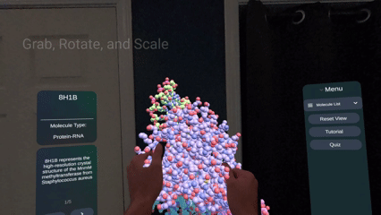
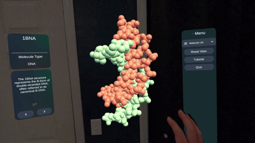
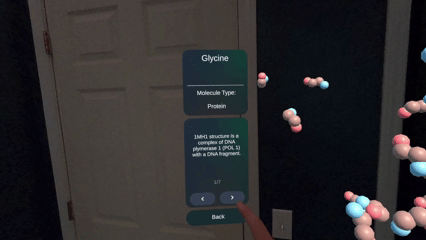
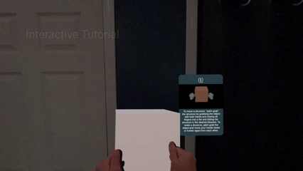
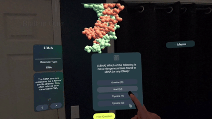

# MolecularLensAR

**MolecularLensAR** is a mixed-reality educational tool built for the **Meta Quest 3**.  
It places a 3D protein model into the user’s physical environment and enables interactive learning through direct manipulation, click-into-model exploration, and a built-in multiple-choice quiz.

The goal of the project is to make molecular structures intuitive to understand through immersive spatial visualization.

---

## Features

### 1. Hand-Based Grab, Rotate, and Scale
- Users interact naturally using hand tracking—no controllers required.
- Protein models can be grabbed, rotated, and scaled directly with hand gestures.
- Designed for intuitive mixed-reality manipulation.

  

### 2. Click-Into-Model Exploration
- Users can select individual model components to explore progressively deeper layers.
- Each selection updates the active model state and highlights the chosen structure.
- Enables clear navigation of complex molecular hierarchies.

  

### 3. Always-Visible Information Panel
- The information panel remains on screen at all times for uninterrupted learning.
- Automatically updates based on the current model layer or component selected.
- Displays structural names, details, and simplified biological descriptions.

  

### 4. Interactive Tutorial
- A built-in, step-by-step tutorial guides new users through core hand-based interactions.
- Covers grabbing, rotating, scaling, selecting components, and using the UI.
- Ensures first-time VR users can quickly understand the interface and functionality.

  

### 5. Instant-Feedback Multiple-Choice Quiz
- Users answer questions using on-screen multiple-choice options.
- Provides immediate feedback to reinforce learning (correct or incorrect).
- No score tracking—focused entirely on exploration and understanding.
- Fully voiced audio.

  

---

## Technology
- Unity (C#)
- Meta XR SDK
- Mixed Reality Passthrough
- Universal Render Pipeline (URP)

---

## Installation on Meta Quest 3

### 1. Download the APK
Download `MolecularLensAR.apk` from the Releases section of this repository.

### 2. Install SideQuest
https://sidequestvr.com/

### 3. Connect Your Headset
- Enable Developer Mode on your Meta Quest device
- Connect your Quest 3 to your PC via USB

### 4. Install the APK via SideQuest
- Open SideQuest
- Select **Install APK from file**
- Choose `MolecularLensAR.apk`

### 5. Launch the Application
On your Quest, navigate to:
Apps → Unknown Sources → MolecularLensAR
